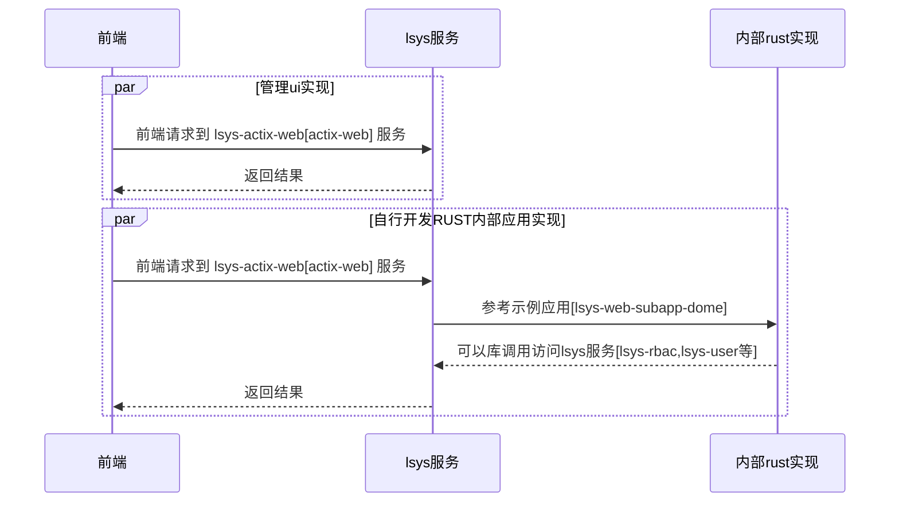
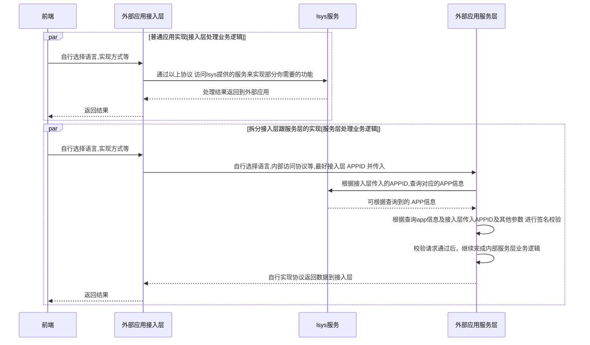

### rust实现的`面向内部应用的应用管理中心`实现

> 适用场景：
> 1. 当你使用rust开发web应用时，使用本项目二次开发可以减少重复工作量。
> 2. 当你需要一个包含oauth的轻量级开放平台服务时,可基于本项目快速实现鉴权，应用管理等.
> 3. 当进行分模块独立开发（如：公司内分团队的各自独立开发）时，可用本项目作为一个内部应用管理中心。
> 4. 当你希望把一些常用服务（如：发送短信，邮件 等）抽离出来公用时,可用本项目实现.

> 在线示例: http://175.178.90.181/ui/#

##### [后端服务](server) 安装

1. 编译 【中途有失败再次执行】
```
cd server && cargo build -r && cd ..
```

2. 导入SQL到数据库
```
导入 ./server/assets/tables.sql 到MYSQL
```

3. 修改你的监听端口,REDIS,MYSQL等
> [./server/examples/lsys-actix-web/.env 会覆盖./server/examples/lsys-actix-web/config/]

```
./server/examples/lsys-actix-web/.env 
```

4. 执行 启动服务
```
cd ./server/examples/lsys-actix-web/ && ../../target/release/lsys-actix-web
```


##### [管理UI](ui) 安装 

1. 修改配置,设置服务地址跟jwt的token等
```
./ui/web/config.json
./ui/wap/config.json
```

2. 编译
```
cd ./ui/web && npm i && npm run build && cd ../..
cd ./ui/wap && npm i && npm run build && cd ../..
cd ..
```

3. 访问 http://127.0.0.1/ui/

#### 二次开发参考时序:

##### 基于rust二次开发

> [基于rust二次开发示例](server/examples/lsys-web-subapp-demo/)




##### 基于HTTP接口方式二次开发

> [通过HTTP接口接入文档](sdk/) 


