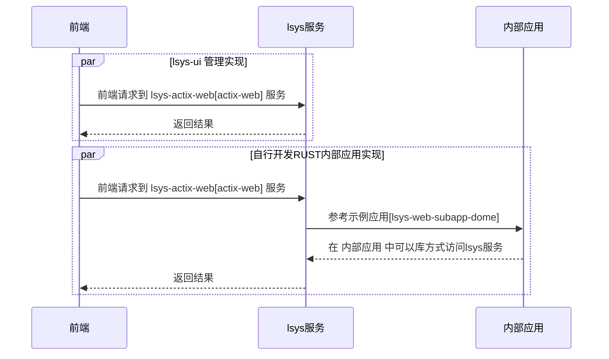
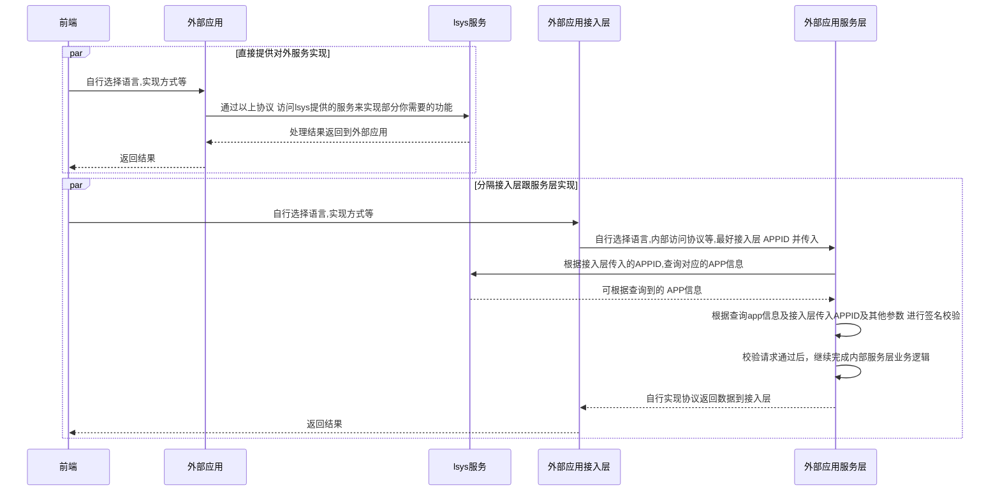

### rust实现的`内部应用开放平台`

> 目标：轻量级 统一用户登陆,站内通用应用管理(如：发送短信，邮件，地址库等) 的实现，减少功能重复开发量

> 第三方服务依赖为: mysql+redis 在 ./examples/lsys-actix-web/.env 配置

> 目前使用示例[examples]基于 actix-web 作为接入web框架，你可选择其他基于 tokio 的web框架

> 已实现对外oauth服务，对内用户对接方案[已存在系统快速对接]思考跟实现中...

##### 后端服务安装

1. 编译 【中途有失败再次执行】
```
cargo build -r
```

2. 导入SQL到数据库
```
导入 ./assets/tables.sql 到MYSQL
```

3. 修改你的REDIS,MYSQL等的配置
> [./examples/lsys-actix-web/.env 的配置覆盖./examples/lsys-actix-web/config/下配置]

```
./examples/lsys-actix-web/.env 
```

4. 执行 启动服务
```
cd ./examples/lsys-actix-web/ && ../../target/release/lsys-actix-web
```


##### 管理UI安装

> git: https://github.com/shanliu/lsys-ui

1. 编译
```
cd web && npm i && npm run build && cd ..
cd wap && npm i && npm run build && cd ..
```

2. 修改配置,设置服务域名等
```
./web/config.json
```

3. 拷贝编译文件到lsys-actix-web静态文件目录中,静态文件目录配置在文件：./examples/lsys-actix-web/app.toml : ui_dir 中
> 备注: UI部分可以自行部署如NGINX服务器中
```
cp ./public/* ../examples/lsys-actix-web/static/ui
```

4. 访问 http://127.0.0.1/ui/

5. 在线示例：http://175.178.90.181/ui/#

```
示例账号：aaaaa
示例密码：000000
```


##### 外部应用实现示例[GO实现]

> git: https://github.com/shanliu/lsys-subapp

> 具体示例参见 lsys-subapp/examples/sub_app && lsys-subapp/examples/basic


#### 二次开发参考时序:

##### 内部应用:[基于RUST库方式二次开发]

>  直接访问:[lsys-ui 管理节目 实现此方式]

> 使用协议为 examples/lsys-actix-web/src/handler/api 实现的JWT协议

> 可基于 基于RUST库方式 开发 内部应用 [可参考examples/lsys-web-subapp-dome实现]




##### 外部应用:[基于HTTP接口方式]

> 外部应用服务层 [通过HTTP接口应用,自行选择开发语言]

> 外部应用访问lsys服务 使用协议为 examples/lsys-actix-web/src/handler/rest 实现接口协议

> 应用可在 lsys-ui 后台实现管理

> lsys服务对应用进行了本地 LruCache ,所以 外部应用服务层 查询APP信息 自行判断是否在加缓存

> GO实现外部应用示例: https://github.com/shanliu/lsys-subapp


