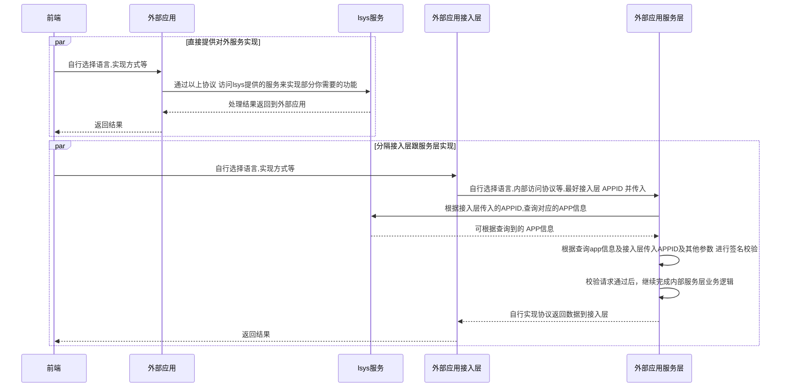

### rust实现的`面向内部应用的应用管理中心`实现

> 目标：轻量级 统一用户登陆,站内通用应用管理(如：发送短信，邮件 等) 的实现。

> 适用场景：
> 1. 当你需要一个包含oauth的轻量级开放平台服务时，可以用此项目快速搭建
> 2. 当你使用rust开发web应用时，使用本项目二次开发可以减少重复工作量，部份功能(如：发送短信，邮件 等)的开箱即用。
> 3. 当进行分模块独立开发（如：公司内分团队的各自独立开发）时，可用本项目作为一个内部应用管理中心，及常用功能(如：发送短信，邮件 等)的统一管理。


##### [后端服务](server) 安装

1. 编译 【中途有失败再次执行】
```
cd server && cargo build -r && cd ..
```

2. 导入SQL到数据库
```
导入 ./server/assets/tables.sql 到MYSQL
```

3. 修改你的REDIS,MYSQL等的配置
> [./server/examples/lsys-actix-web/.env 的配置覆盖./server/examples/lsys-actix-web/config/下配置]

```
./server/examples/lsys-actix-web/.env 
```

4. 执行 启动服务
```
cd ./server/examples/lsys-actix-web/ && ../../target/release/lsys-actix-web
```


##### [管理UI](ui) 安装 

1. 修改配置,设置服务地址跟jwt的token等
```
./ui/web/config.json
./ui/wap/config.json
```

2. 编译
```
cd ./ui/web && npm i && npm run build && cd ../..
cd ./ui/wap && npm i && npm run build && cd ../..
cd ..
```

3. 访问 http://127.0.0.1/ui/

4. 在线示例：http://175.178.90.181/ui/#

```
示例账号：aaaaa
示例密码：000000
```

#### 二次开发参考时序:

##### 基于rust二次开发

> [可参考示例:server/examples/lsys-web-subapp-demo](server/examples/lsys-web-subapp-demo/)

> 基础类功能建议用此方式


##### 基于HTTP接口方式接入

> 通过HTTP接口接入 [go sdk](sdk/go/) 业务类功能建议用此方式

> GO实现外部应用示例 参考 [基本使用](sdk/go/examples/basic/)  && [外部应用服务层](sdk/go/examples/sub_app/)

> 备注:应用信息查询接口使用了本地 LruCache 缓存

> 备注:[rest服务层接口代码路径:server/examples/lsys-actix-web/src/handler/rest](server/examples/lsys-actix-web/src/handler/rest)


