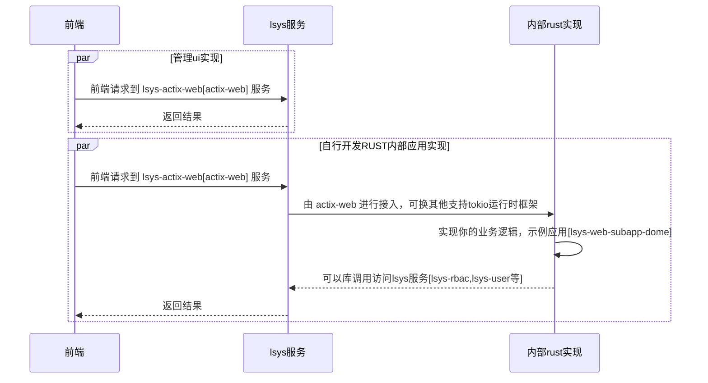
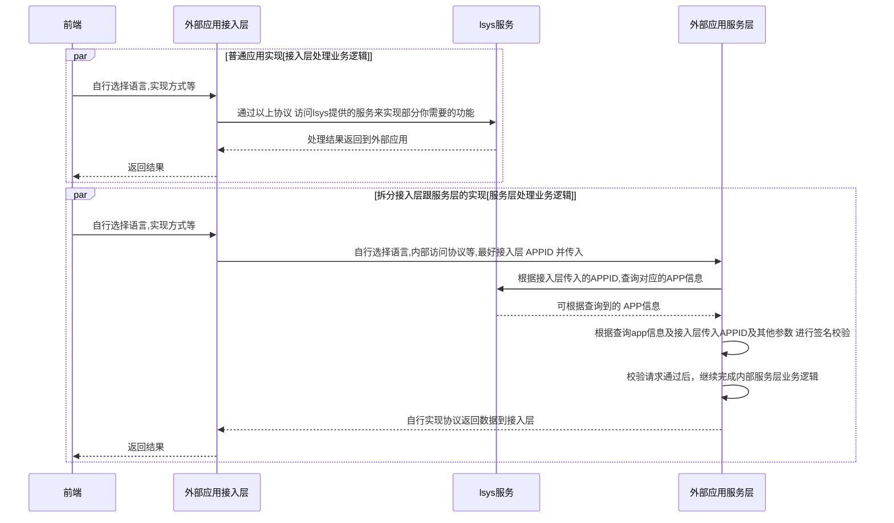

### rust实现的 `内部应用应用管理中心` 

> 适用场景：
> 1. 当你使用rust开发web应用时，使用本项目二次开发可以减少重复工作量。
> 2. 当你需要一个包含oauth的轻量级开放平台服务时,可基于本项目快速实现鉴权，应用管理等.
> 3. 当进行分模块独立开发（如：公司内分团队的各自独立开发）时，可用本项目作为一个内部应用管理中心。
> 4. 当你希望把一些常用服务（如：发送短信，邮件 等）抽离出来公用时,可用本项目实现.


> 在线示例: https://lsys.cc/ [账号:aaaaa 密码:000000]


#### 配置跟编译

1. 执行编译

> 编译生成文件在 `./build` 中,并同时可生成 `./build` 目录的压缩包

> 仅拷贝生成的 `./build` 到你的服务器即可,其他文件可以删除.

> Windows(64bit)系统下可以下载 lsys-for-windows.zip 跳过此编译过程

> windows
```
.\build.cmd zip assets 
#zip :可选,生成 lsys-for-windows.zip 
#assets :可选,从github下载对应资源
```

> linux or macos
```
bash ./build.sh tar assets
#zip :可选,生成 lsys.tar.gz
#assets :可选,从github下载对应资源
```

2. 导入SQL到数据库
```
mysql -u your_username -p your_database < ./build/assets/tables.sql #导入到你的MYSQL
```

3. 修改项目配置

> 修改服务器配置。

```
./build/.env  # 配置文件
```


> 修改UI访问后台服务地址

```
./build/ui/config.js # ui 使用内置HTTP服务无需修改,自行部署(如nginx)时指定,示例: "serverURL": "//lsys.cc/"
```

4. 启动服务

> 下载文件[2023-7-area-code.csv.gz](https://github.com/shanliu/area-db/blob/main/data/2023-7-area-code.csv.gz) 到 `build/data` 目录

> [可选] 下载IP文件 `IP2LOCATION-LITE-DB11.BIN` 到 `build/data/` 目录

> 执行 `./actix-web-dome ` 启动服务。注意:初次启动会慢一些。

> 可使用 `nohup ./actix-web-dome &` 后台执行

> 根据`.env`配置访问服务.默认地址:http://127.0.0.1:8080/ 

#### 二次开发时序参考

##### 基于rust二次开发

> [基于rust二次开发示例](server/examples/lsys-web-subapp-demo/)




##### 基于HTTP接口方式二次开发

> [通过HTTP接口接入文档](sdk/) 


