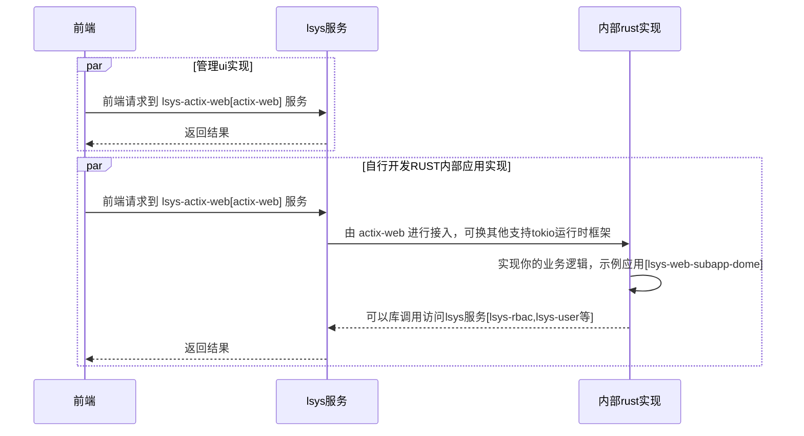
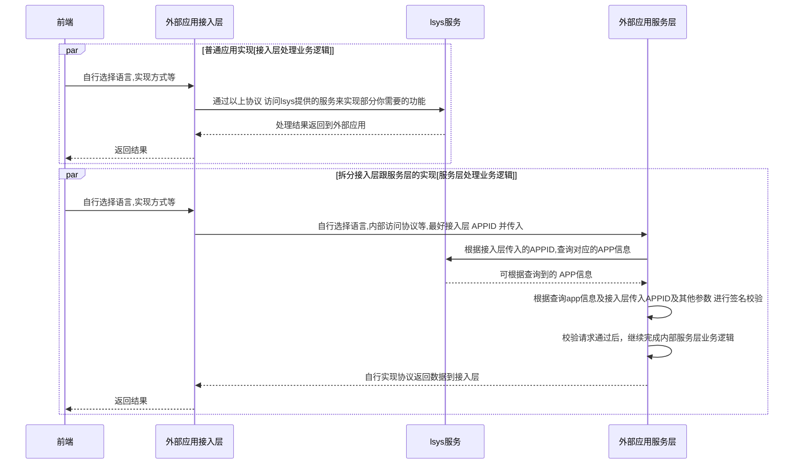

### lsys - 共享服务平台

> 适用场景：
> 1. 多系统统一登录与认证
> 2. 共享短信、邮件、文件存储等服务
> 3. 统一权限管理
> 4. Rust 项目可直接引用模块


> 在线示例: https://lsys.cc/


#### 配置跟编译

1. 执行编译

> 项目依赖redis&mysql。

> 执行编译后，仅需拷贝 `./build` 到服务器。

> Windows(64bit)系统下可以下载 lsys-for-windows.zip 跳过编译。

> 编译前请修改ui访问配置 [ui/.env.production](ui/.env.production) 或 编译后在目录`build/ui`中搜索并替换

> windows
```
.\build.cmd zip assets 
#zip :可选,生成 lsys-for-windows.zip 
#assets :可选,从github下载对应资源
```

> linux or macos
```
bash ./build.sh tar assets
#zip :可选,生成 lsys.tar.gz
#assets :可选,从github下载对应资源
```

2. 导入SQL到数据库
```
mysql -u your_username -p your_database < ./build/assets/tables.sql #导入到你的MYSQL
```

3. 修改项目配置

> 修改服务器配置。

```
./build/.env  # 服务配置
```

https://github.com/shanliu/lsys/blob/d14b0681d7f6aa5f64c232d6f03b6f61106ba0b6/server/examples/lsys-actix-web/.env.example#L1-L27


4. 启动服务

> 源码编译时，可在 [https://github.com/shanliu/lsys/releases/tag/v0.0.0](https://github.com/shanliu/lsys/releases/tag/v0.0.0) 下载项目使用的资源文件,下载后放置于  `build/data` 中。

> 执行 `./actix-web-dome ` 启动服务。注意:初次启动会慢一些。

> 可使用 `nohup ./actix-web-dome &` 后台执行

> 根据`.env`配置访问服务.默认地址:http://127.0.0.1:8080/ 


#### 二次开发时序参考

##### 基于rust二次开发

> [基于rust二次开发示例](server/examples/lsys-web-subapp-demo/)


```mermaid
sequenceDiagram
    par 管理ui实现
    前端->>lsys服务: 前端请求到 lsys-actix-web[actix-web] 服务
    lsys服务-->>前端: 返回结果
    end
    par 自行开发RUST内部应用实现
    前端->>lsys服务: 前端请求到 lsys-actix-web[actix-web] 服务
    lsys服务->>内部rust实现: 由 actix-web 进行接入，可换其他支持tokio运行时框架
    内部rust实现->>内部rust实现: 实现你的业务逻辑，示例应用[lsys-web-subapp-dome]
    内部rust实现-->>lsys服务: 可以库调用访问lsys服务[lsys-rbac,lsys-user等]
    lsys服务-->>前端: 返回结果
    end
```


##### 基于HTTP接口方式二次开发

> [通过HTTP接口接入文档](sdk/) 


```mermaid
sequenceDiagram
    par 普通应用实现[接入层处理业务逻辑]
    前端->>外部应用接入层: 自行选择语言,实现方式等
    外部应用接入层->>lsys服务: 通过以上协议 访问lsys提供的服务来实现部分你需要的功能
    lsys服务-->>外部应用接入层: 处理结果返回到外部应用
    外部应用接入层-->>前端: 返回结果
    end
    par 拆分接入层跟服务层的实现[服务层处理业务逻辑]
    前端->>外部应用接入层: 自行选择语言,实现方式等
    外部应用接入层->>外部应用服务层:自行选择语言,内部访问协议等,最好接入层 APPID 并传入
    外部应用服务层->>lsys服务: 根据接入层传入的APPID,查询对应的APP信息
    lsys服务-->>外部应用服务层: 可根据查询到的 APP信息 
    外部应用服务层->>外部应用服务层: 根据查询app信息及接入层传入APPID及其他参数 进行签名校验
    外部应用服务层->>外部应用服务层: 校验请求通过后，继续完成内部服务层业务逻辑
    外部应用服务层-->>外部应用接入层: 自行实现协议返回数据到接入层
    外部应用接入层-->>前端: 返回结果
    end
```
