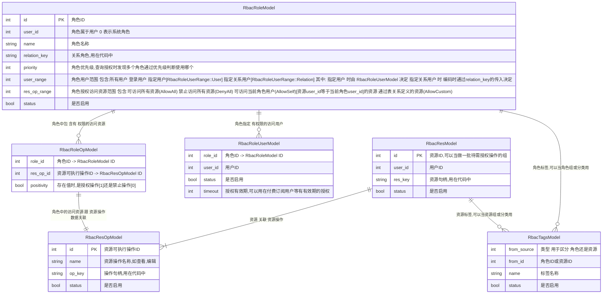
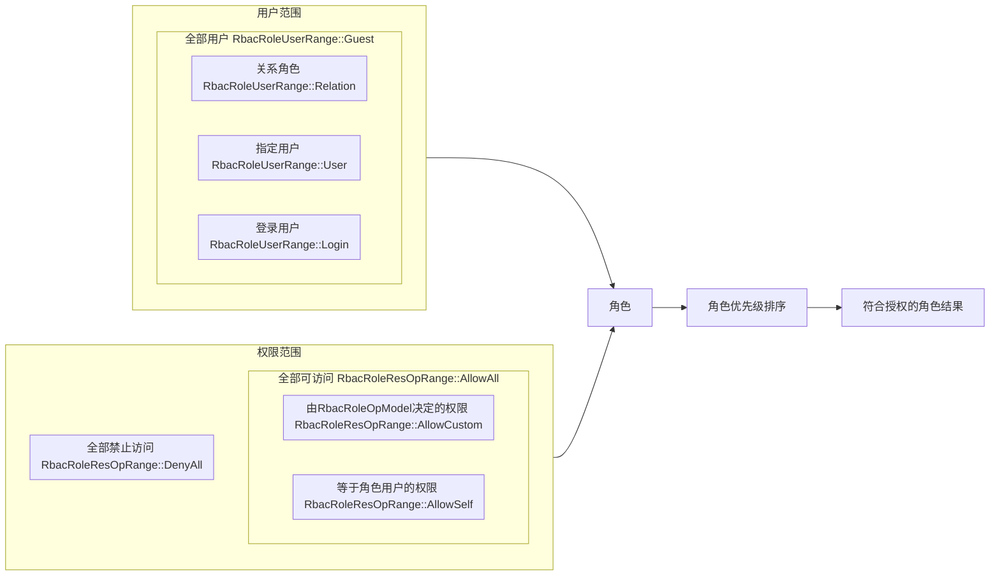
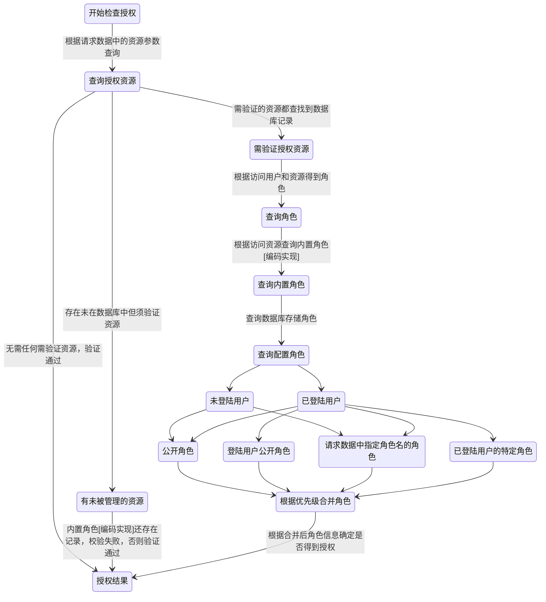

##### 权限模块

> RBAC权限模块实现

> 权限中角色-用户-资源关系

```mermaid
erDiagram
    RbacResModel ||--|{ RbacResOpModel : "资源 关联 资源操作"
    RbacResModel{
        int id PK "资源ID,可以当做一批待需授权操作的组"
        int user_id "用户ID"
        string res_key "资源句柄,用在代码中"
        bool status "是否启用"
    }
    RbacResOpModel{
        int id PK "资源可执行操作ID"
        string name "资源操作名称,如查看,编辑"
        string op_key "操作句柄,用在代码中"
        bool status "是否启用"
    }
    RbacRoleModel ||--o{ RbacRoleUserModel : "角色指定 有权限的访问用户"
    RbacRoleModel ||--o{ RbacRoleOpModel : "角色中包 含有 权限的访问资源"
    RbacRoleOpModel ||--|| RbacResOpModel : "角色中的访问资源 跟 资源操作数据关联"
    RbacRoleModel{
        int id PK "角色ID"
        int user_id "角色属于用户 0 表示系统角色"
        string name "角色名称"
        string relation_key "关系角色,用在代码中"
        int priority "角色优先级,查询授权时发现多个角色通过优先级判断使用哪个"
        int user_range "角色用户范围 包含:所有用户 登录用户 指定用户[RbacRoleUserRange::User] 指定关系用户[RbacRoleUserRange::Relation] 其中: 指定用户 时由 RbacRoleUserModel 决定 指定关系用户 时 编码时通过relation_key的传入决定"
        int res_op_range "角色授权访问资源范围 包含:可访问所有资源(AllowAll) 禁止访问所有资源(DenyAll) 可访问当前角色用户(AllowSelf)[资源user_id等于当前角色user_id]的资源 通过表关系定义的资源(AllowCustom)"
        bool status "是否启用"
    }
    RbacRoleOpModel{
        int role_id "角色ID -> RbacRoleModel ID"
        int res_op_id "资源可执行操作ID -> RbacResOpModel ID"
        bool positivity "存在值时,是授权操作[1]还是禁止操作[0]"
    }
    RbacRoleUserModel{
        int role_id "角色ID -> RbacRoleModel ID"
        int user_id "用户ID"
        bool status "是否启用"
        int timeout "授权有效期,可以用在付费订阅用户等有有效期的授权"
    }
    RbacRoleModel ||--o{ RbacTagsModel :"角色标签,可以当角色组或分类用"
    RbacResModel ||--o{ RbacTagsModel :"资源标签,可以当资源组或分类用"
    RbacTagsModel{
        int from_source "类型 用于区分 角色还是资源"
        int from_id "角色ID或资源ID"
        string name "标签名称"
        bool status "是否启用"
    }
```

> 用户范围-角色-资源范围关系

```mermaid
flowchart LR
    subgraph 用户范围
    subgraph "全部用户 RbacRoleUserRange::Guest"
    subgraph "登录用户 RbacRoleUserRange::Login"
    end
    subgraph "指定用户 RbacRoleUserRange::User" 
    end
    subgraph "关系角色 RbacRoleUserRange::Relation" 
    end
    end
    end
    subgraph 权限范围
    subgraph "全部可访问 RbacRoleResOpRange::AllowAll"
    subgraph "等于角色用户的权限 RbacRoleResOpRange::AllowSelf"
    end
    subgraph "由RbacRoleOpModel决定的权限 RbacRoleResOpRange::AllowCustom" 
    end
    end
    subgraph "全部禁止访问 RbacRoleResOpRange::DenyAll"
    end
    end
    用户范围 --> 角色 
    权限范围 --> 角色 
    角色 --> 角色优先级排序 --> 符合授权的角色结果
```

> 授权过程

```mermaid
stateDiagram-v2
    开始检查授权 --> 查询授权资源:根据请求数据中的资源参数查询
    查询授权资源 --> 授权结果:无需任何需验证资源，验证通过
    查询授权资源 --> 有未被管理的资源:存在未在数据库中但须验证资源
    有未被管理的资源 --> 授权结果:内置角色[编码实现]还存在记录，校验失败，否则验证通过
    查询授权资源 -->  需验证授权资源:需验证的资源都查找到数据库记录
    需验证授权资源 --> 查询角色:根据访问用户和资源得到角色
    查询角色 --> 查询内置角色:根据访问资源查询内置角色[编码实现]
    查询内置角色 --> 查询配置角色:查询数据库存储角色
    查询配置角色 --> 已登陆用户
    查询配置角色 --> 未登陆用户
    未登陆用户 --> 公开角色
    未登陆用户 --> 请求数据中指定角色名的角色
    已登陆用户 --> 公开角色
    已登陆用户 --> 请求数据中指定角色名的角色
    已登陆用户 --> 登陆用户公开角色
    已登陆用户 --> 已登陆用户的特定角色
    公开角色 --> 根据优先级合并角色
    登陆用户公开角色 --> 根据优先级合并角色
    请求数据中指定角色名的角色 --> 根据优先级合并角色
    已登陆用户的特定角色 --> 根据优先级合并角色
    根据优先级合并角色 --> 授权结果:根据合并后角色信息确定是否得到授权
```
