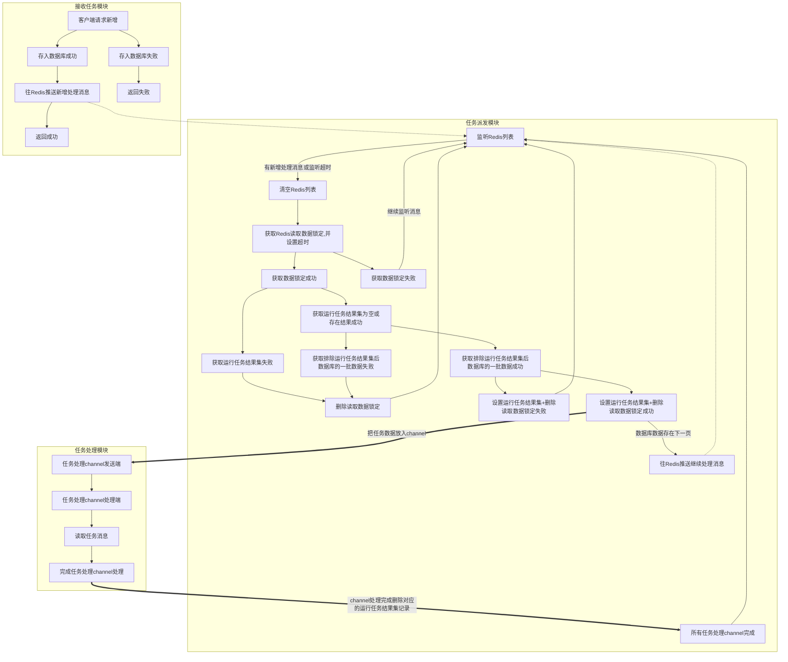

##### 信息发送模块

> 功能实现中。。。。

> 对短信 邮件等对外发送信息进行二次封装 

> 目标及功能

1. 隔离应用对外部接口依赖
2. 发送日志跟发送效率保证
3. 常用发送方式的封装方便调用，如：验证码，批量广告，定时通知等


#### 流程图:



#### 运行任务结果集 的数据格式:

```
run-task[$task_id-num]=1//原子增
run-task[$task_id]={time:'任务开始',host:'任务所在主机'}
```

#### 配置

> 任务处理channel的大小

> 每次获取数据库记录数量,且`>=`任务处理channel的大小

