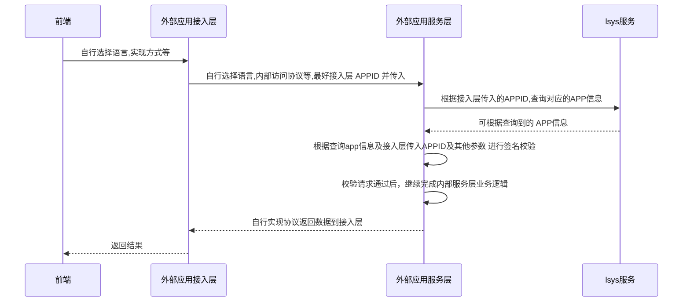

### 基于HTTP接口方式二次开发示例

> 基于GO实现外部应用示例

> 时序介绍

```mermaid
sequenceDiagram
    前端->>外部应用接入层: 自行选择语言,实现方式等
    外部应用接入层->>外部应用服务层:自行选择语言,内部访问协议等,最好接入层 APPID 并传入
    外部应用服务层->>lsys服务: 根据接入层传入的APPID,查询对应的APP信息
    lsys服务-->>外部应用服务层: 可根据查询到的 APP信息 
    外部应用服务层->>外部应用服务层: 根据查询app信息及接入层传入APPID及其他参数 进行签名校验
    外部应用服务层->>外部应用服务层: 校验请求通过后，继续完成内部服务层业务逻辑
    外部应用服务层-->>外部应用接入层: 自行实现协议返回数据到接入层
    外部应用接入层-->>前端: 返回结果
```

> [main.go](main.go) 为内部服务实现,HTTP服务基于GIN

> [rest_api_test.go](example_test.go) 为模拟外部调用此应用接口示例
