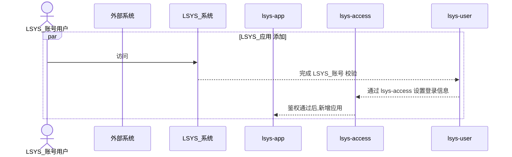
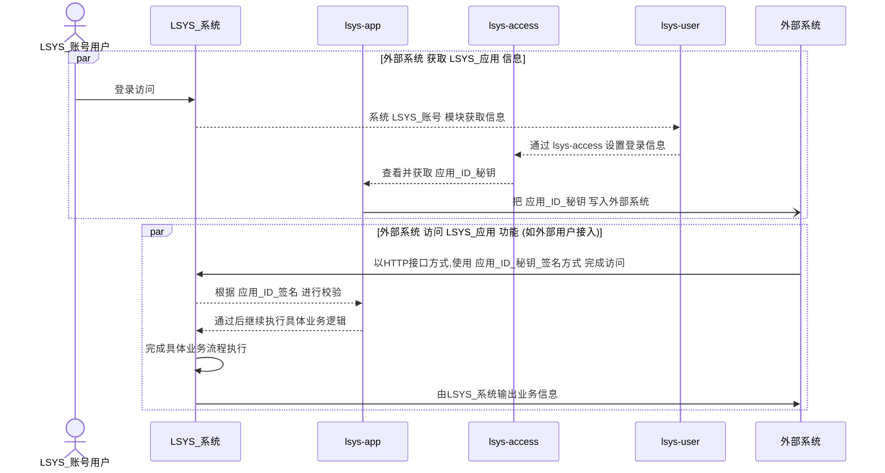
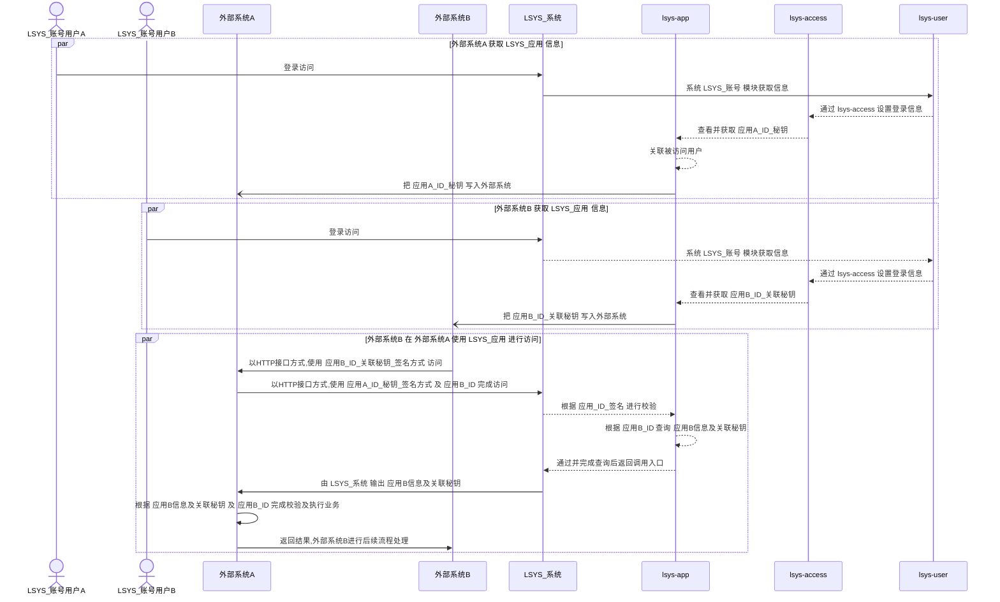
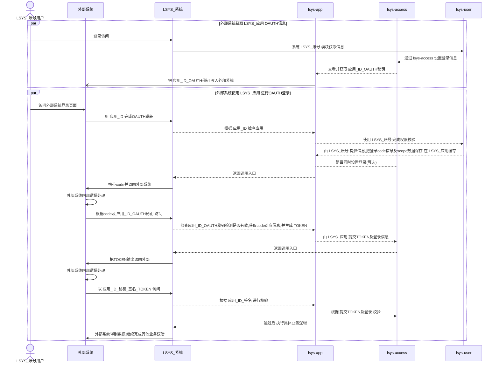
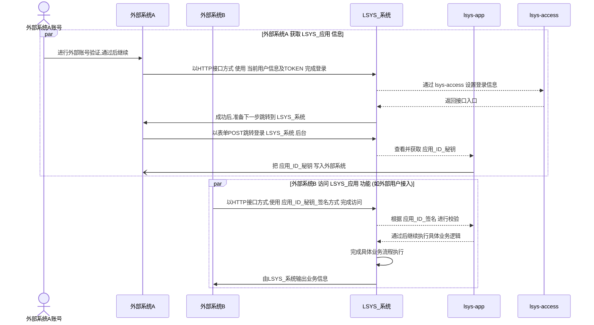
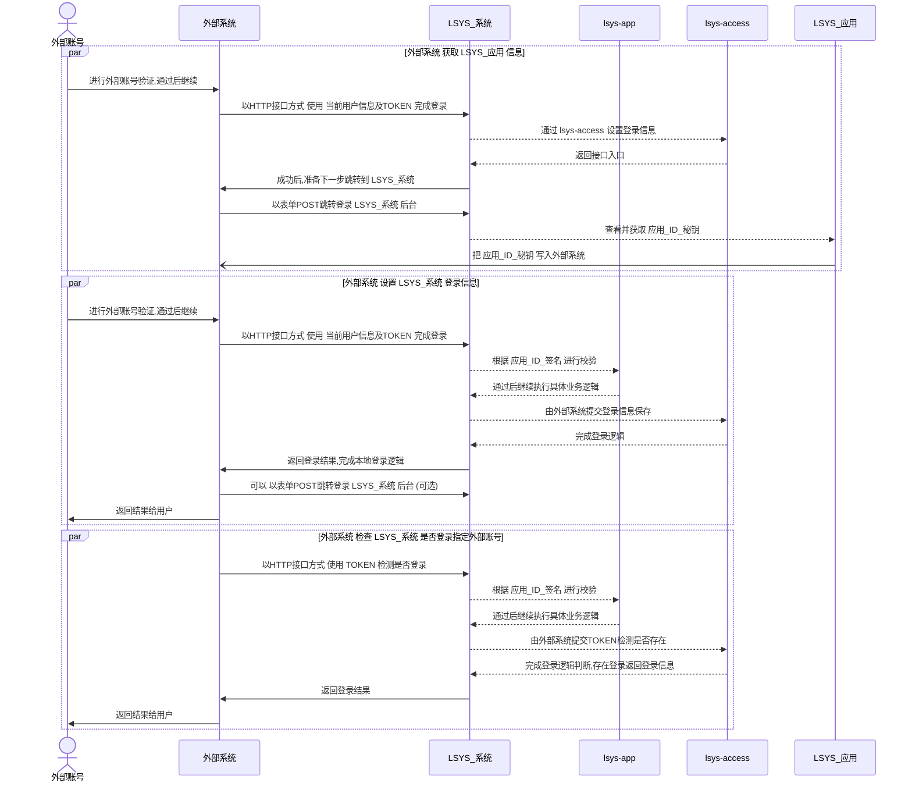
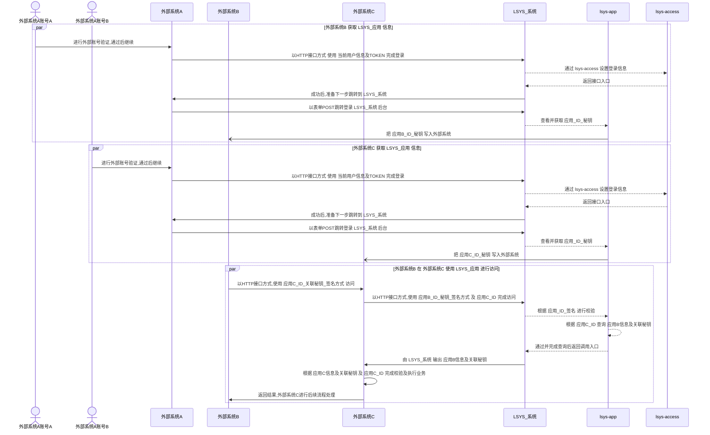
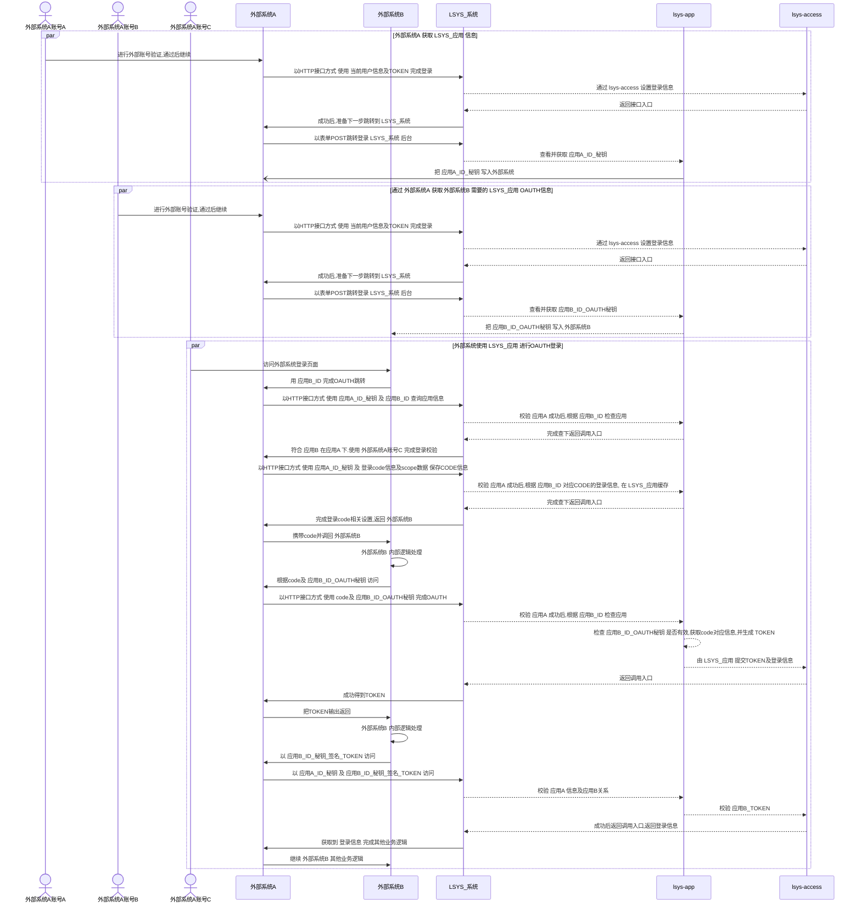

### 服务层实现

> 执行 sql_merge.[sh|cmd] 创建汇总各模块使用到的SQL语句:tables.sql 后导入到mysql中.

> 服务层依赖: mysql+redis 在 ./examples/lsys-actix-web/.env 配置

> 使用示例[examples]目前基于 actix-web 作为接入web框架，你可选择其他基于 tokio 的web框架

### 编译&&启动

1. 导入SQL到数据库
```
./sql_merge.[sh|cmd] #创建tables.sql
mysql -u your_username -p your_database < ./tables.sql #导入SQL到mysql
```

2. 修改你的REDIS,MYSQL,jwt token等配置
> [./examples/lsys-actix-web/.env 的配置会覆盖./examples/lsys-actix-web/config/下配置]

```
./examples/lsys-actix-web/.env 
```

3. 启动开发环境
```
cd ./examples/lsys-actix-web/ && cargo run #cargo run -r 
```


### 接入时序说明

#### 内置账号相关接入流程图

> 应用添加流程



> 内部应用使用流程



> 外部应用使用流程



> OAUTH应用使用流程



#### 外部账号相关接入流程图

> 外部账号接入 依赖: 内置账号 > 内部应用流程 


> 内部应用使用流程



> 外部账号 登录 LSYS_系统 




> 外部应用使用流程




> OAUTH应用使用流程




#### 相关节点说明

1. LSYS_授权 : 完成登录用户鉴权及用户映射系统

2. LSYS_账号 : 为内置的账号系统,完成内部账号登录依赖 LSYS_授权

3. LSYS_应用 : 应用管理系统,依赖 LSYS_授权 前置鉴权 

4. LSYS_系统 : 整体系统用户依赖 LSYS_授权 , LSYS_账号 为可选内置用户系统

5. 外部账号 : 账号相关信息由外部独立系统实现

6. 外部系统_LSYS_应用 : 外部系统对应在 LSYS_系统 的一个或多个 LSYS_应用 

7. 外部系统 : 外部账号登录外部系统完成,可 LSYS_应用 方式接入 LSYS_系统 ,并由 LSYS_授权 完成到 LSYS_系统 登录
