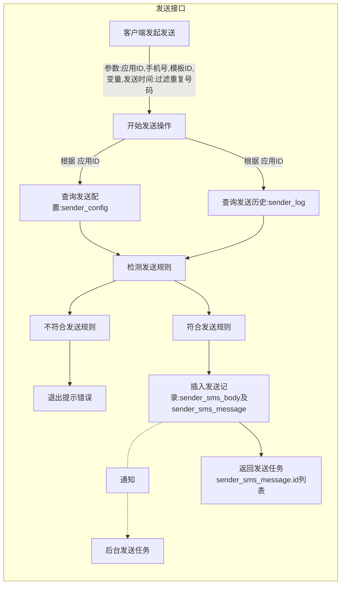
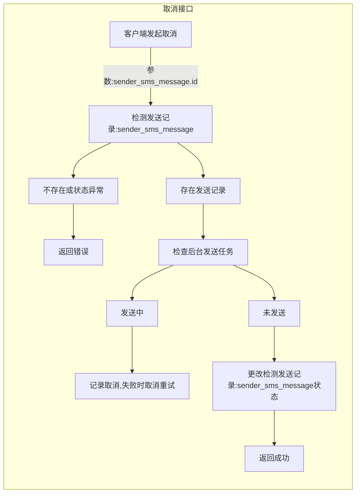
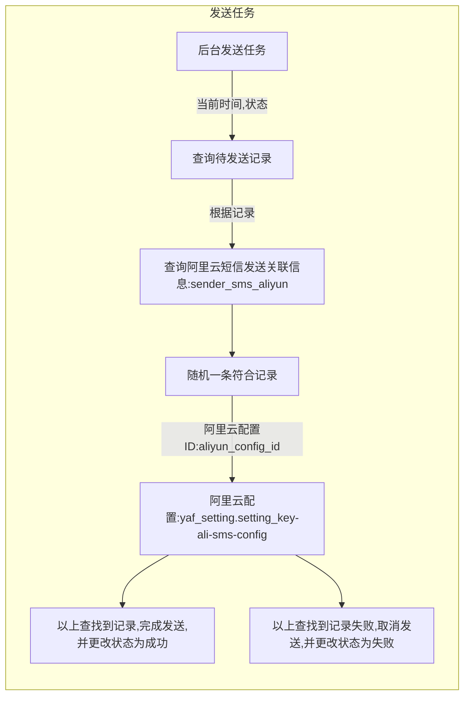

##### 短信发送模块实现

> 以下为需要实现的功能:

> 支持 定时发送,批量发送

> 后台配置发送频率[禁止发送黑名单],配置短信发送的关联接口`目前先实现阿里云发送`

> 后台界面取消,接口取消发送

> 后台查看发送历史

> 接口接入示例:待实现

#### 短信发送流程图:

```mermaid
flowchart LR
    subgraph send[发送接口]
        客户端发起发送 -- 参数:应用ID,手机号,模板ID,变量,发送时间:过滤重复号码 --> 开始发送操作 -- 根据 应用ID --> 查询发送配置:sender_config--> 检测发送规则
        开始发送操作  -- 根据 应用ID --> 查询发送历史:sender_log -->检测发送规则
        检测发送规则 --> 不符合发送规则 --> 退出提示错误
        检测发送规则 --> 符合发送规则 --> 插入发送记录:sender_sms_body及sender_sms_message -.-通知 -.-> 后台发送任务
        插入发送记录:sender_sms_body及sender_sms_message --> 返回发送任务sender_sms_message.id列表
    end
```

#### 短信取消发送流程图:

```mermaid
flowchart LR
    subgraph cancel[取消接口]
        客户端发起取消 -- 参数:sender_sms_message.id --> 检测发送记录:sender_sms_message
        检测发送记录:sender_sms_message --> 不存在或状态异常--> 返回错误
        检测发送记录:sender_sms_message --> 存在发送记录 --> 检查后台发送任务 --> 发送中 --> 记录取消,失败时取消重试
        检查后台发送任务 --> 未发送 --> 更改检测发送记录:sender_sms_message状态 --> 返回成功
    end
```

#### 阿里云后台发送短信流程图:

```mermaid
flowchart LR
    subgraph task[发送任务]
        后台发送任务 -- 当前时间,状态-->查询待发送记录--根据记录 --> 查询阿里云短信发送关联信息:sender_sms_aliyun --> 随机一条符合记录 -- 阿里云配置ID:aliyun_config_id --> 阿里云配置:yaf_setting.setting_key-ali-sms-config
        阿里云配置:yaf_setting.setting_key-ali-sms-config --> 以上查找到记录,完成发送,并更改状态为成功
        阿里云配置:yaf_setting.setting_key-ali-sms-config --> 以上查找到记录失败,取消发送,并更改状态为失败
    end
```