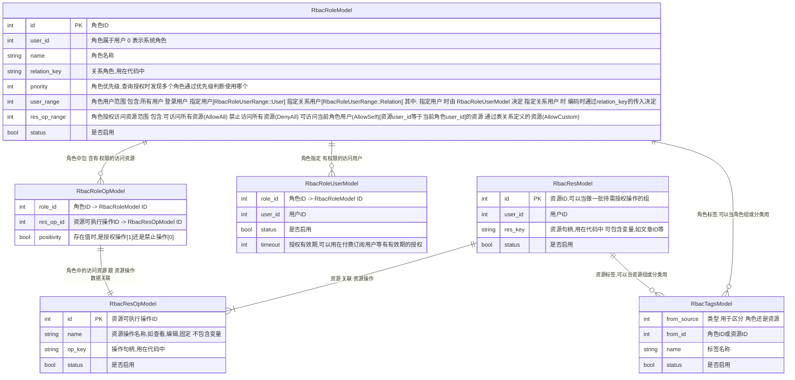
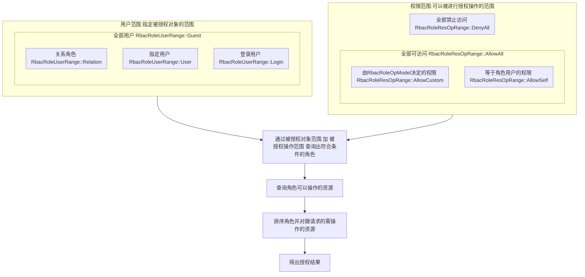
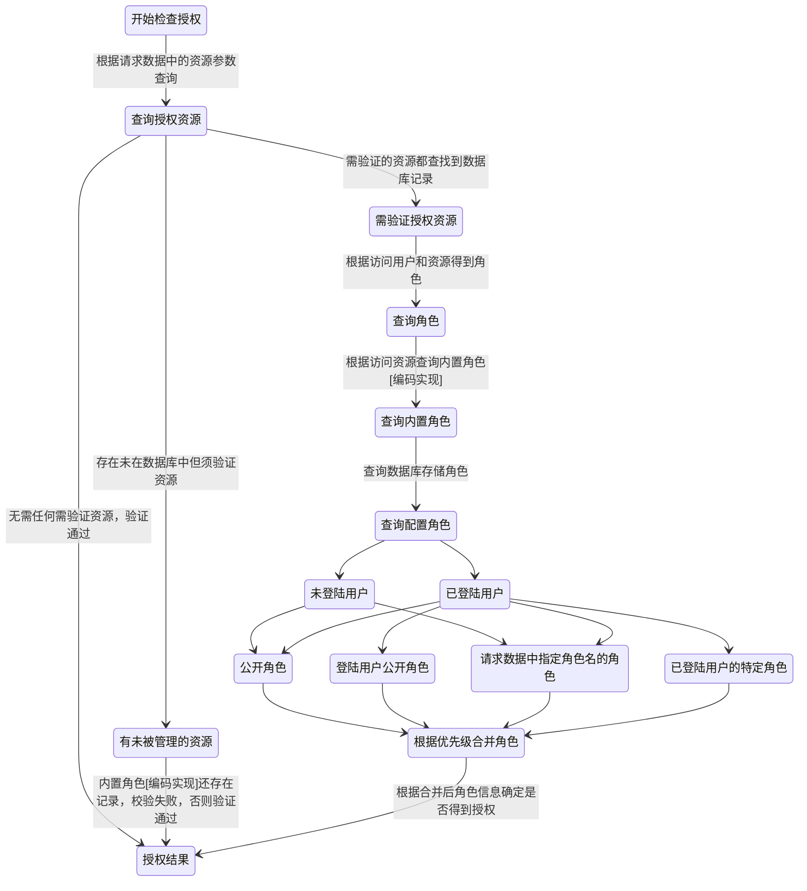

### 权限模块

> RBAC权限模块实现 逻辑跟验证权限过程参见以下说明

#### 权限中角色-用户-资源关系

> 资源属性: 资源操作 资源属于用户 资源句柄 例:
```
用户文章 
    资源操作:文章修改,文章新增,文章删除
    资源属于用户:文章用户ID
    资源句柄:文章ID+自定义字符生成
```

> 角色 用于关联用户跟资源 
```
用户:可以是指定用户ID,或全部用户,或已登录用户 [即:用户范围]
资源:可以是上面定义的,或任意资源,或禁止访问资源 [即:权限范围]
```
> 资源 - 角色 - 用户 ER 图


#### 权限校验代码入口

> 参见 RbacAccess 的 check 方法,参数如下:

> 由 user_id 跟 relation_key_roles 作为 用户范围 来源 
```
参数作用说明:
通过 user_id 可以获取 公开用户 登陆用户 或 RbacRoleUserModel 3个途径的角色数据
通过 relation_key_roles 可以获取 特定关系 的角色
    当 relation_key_roles 中的 user_id = 0 时为系统控制的某些角色 如某subapp是否可以发送短信
    当 relation_key_roles 中的 user_id > 0 时为用户控制的某些角色，如某用户的粉丝，好友等
```

> 由 check_vec 作为 权限范围 其中一个来源
```
参数作用说明:
check_vec 由 RbacRoleOpModel 配置
RbacRoleResOpRange::AllowAll｜AllowSelf｜DenyAll 由代码定义特定逻辑
```

> 由上面的数据确定最后授权结果,如下图:




#### 完整授权流程




#### 授权使用示例

> 确定资源类型

1. 系统资源 
```
用户id=0 
例: 用户能否进行登陆操作 应用能否发送短信等
```
2. 用户资源
```
用户id>0 
例: 用户发表文章能否被另一个用户查看 oauth用户时登陆信息被应用获取等
```

> 确定用户范围

1. 未登陆用户
2. 已登陆用户


```
例1 子应用的发送短信权限
1. 确定该操作为:用户对系统的操作
2. 预期该功能入参: 用户 应用id 短信内容 手机号
3. 定义资源：子应用 操作: 发送短信
4. 定义关系key：app-{应用id} 用户在系统总后台配置 该关系的权限
验证流程:由应用用户id+关系key+资源&发送操作 得出是否可以发送短信
```

```
例2 a用户查看b用户的某文章,a为b的粉丝
1. 确定该操作为:用户对用户的操作
2. 预期该功能入参: a用户id b用户id a用户跟b用户关系
3. 定义资源：{用户b}资源 操作: {文章id}查看
4. 定义关系key：firend-{b用户id} 用户b在用户后台或接口配置 该关系的权限
验证流程:由应用a用户id+关系key+{用户b}资源&{文章id}查看 得出是否可以发送短信
```