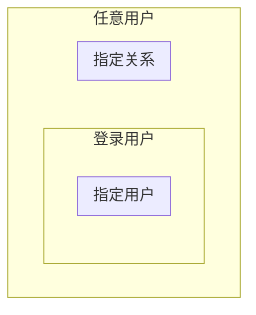
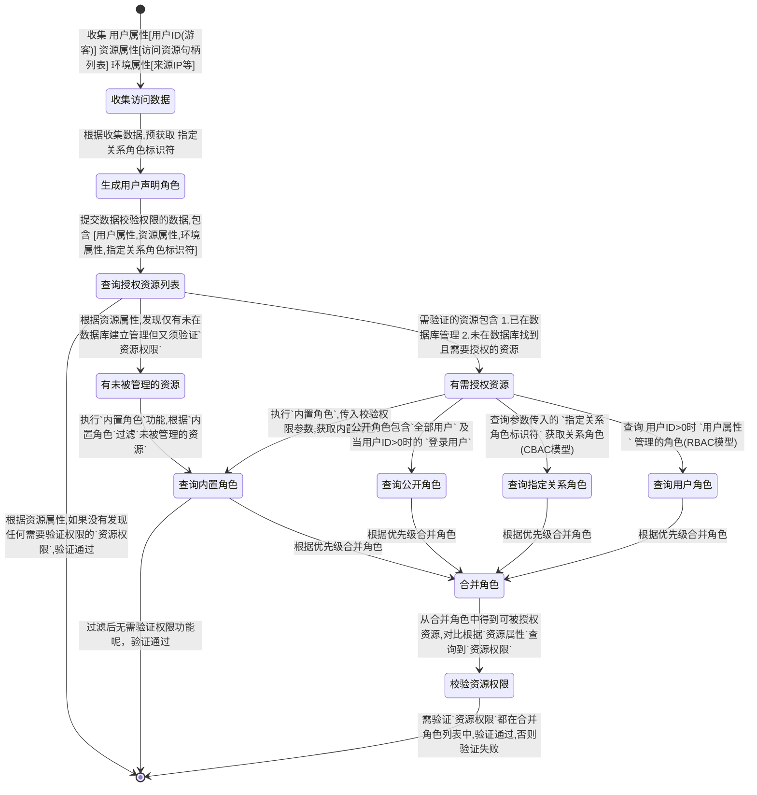
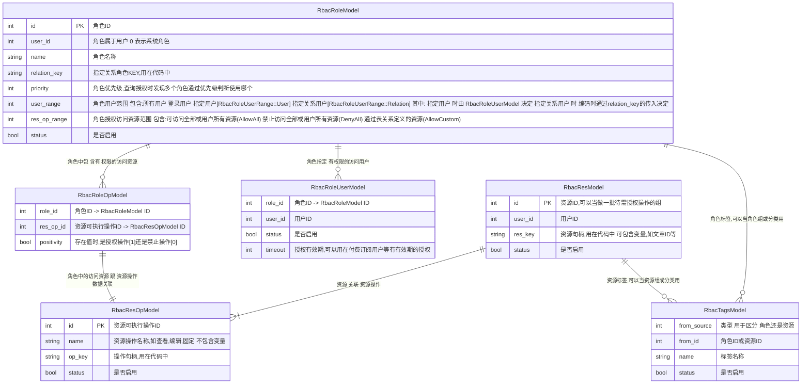

## 常见的管理模型

1. 基于资源的访问控制

> 示例:
```
假设有一个页面:
 1.为页面分配一个访问状态
当用户尝试访问页面时:
 系统检查页面的状态是否可访问，如果是，则允许访问；否则拒绝访问。
```

2. DAC模型[ACL:访问控制列表]

> 示例:
```
假设有一个文件系统:
 1.为每个用户分配一个唯一的用户ID
 2.为每个文件或目录[资源]分配一个访问控制列表
 3.这个列表将包含可以访问该文件或目录的用户ID
当用户尝试访问某个文件或目录时:
 系统检查其用户ID是否在访问控制列表中，如果是，则允许访问；否则拒绝访问。
```

3. RBAC(Role-Based Access Control)模型

> 基于角色的访问控制

> 示例:
```
假设有一个系统:
 1. 系统内有N个用户
 2. 系统功能有N项
 3. 建立用户分组[角色],为分组添加用户,为分组添加接口[资源]
当用户尝试访问系统接口[资源]时:
 1. 根据访问用户可获取用户分组
 2. 根据用户分组获取可用接口[资源]
 3. 检查当前访问资源是否仅在上述获取到的接口列表中
 4. 如果是，则允许访问；否则拒绝访问。
```

4. CBAC模型

> 基于声明的访问控制

> 示例:
```
微博粉丝场景:
当A是B粉丝，可以让A访问B的文字
A不是B的粉丝进行访问时，请求不带声明的特定角色，访问拒绝
A作为B的粉丝进行访问时，请求验证权限时传入A作为B粉丝的角色，访问通过
```

5. PBAC & MAC模型

> 基于规则的访问控制

> 示例:
```
在 SELinux 中，访问控制的策略是预定义的，并且由系统管理员进行配置。
```

6. ABAC模型

> 基于属性的访问控制，访问权限基于用户和资源的属性

> 资源属性+用户属性+环境属性 => 决策引擎 => 授权结果


## 当前系统权限说明

> 本系统功能描述：授权方[系统或指定用户] 对 访问方[被授权用户或游客] 在进行 指定资源(系统资源或用户资源)访问时 进行授权的行为

> 本系统基于rbac模型:本系统包含 角色+资源[user_id=0]的系统rbac模型，角色+资源[user_id>0]的指定用户的rbac模型

> 注意:角色+资源[user_id=0]时，可往角色添加用户的资源,即 资源[user_id>0] 添加到 角色[user_id=0] 中

> 本系统在基础的rbac模型下的进行以下扩充
```
在角色-用户关系[rbac_role_user]基础上
    新增 任意用户 ，登录用户, 指定关系[模拟CBAC模型] 3个用户关系
        
在角色-功能关系[yaf_rbac_role_op]基础上
    当用户id=0时,新增 授权访问任何资源 ，自定义配置访问资源 , 禁止访问任何资源 3个功能关系
    当用户id>0时,新增 授权访问本用户任何资源，自定义配置本用户可访问资源，禁止访问本用户任何资源 3个功能关系
```


### 相关定义

#### 用户定义
> 用户为资源访问者,包含游客跟登录用户

1. 约定:当访问的用户id=0时，该用户为游客
2. 约定:当访问的用户id>0时，为指定用户的ID

#### 资源定义
> 需要被授权管理的对象,分两类：系统资源跟用户资源,如:用户发布的文章,电商中的商品等

1. 约定:资源组成为 用户ID+`资源标识`
2. 约定:当资源的用户id=0时，该资源为系统资源
3. 约定:当资源的用户id>0时，该资源为该用户的资源

#### 资源权限定义
> 对资源可用的操作,如:文章新增,修改;商品的添加,修改等

1. 约定:对资源的每一种操作权限,定义一个`资源权限标识`进行管理
2. 验证权限时:传入 `资源标识` + 用户ID + `资源权限标识` 来进行权限校验
3. 验证权限时:在调用时,决定指定 `资源权限标识` 是否是可选的授权校验.(适应场景:当资源被建立时需要校验授权,未被建立时无需校验)

#### 角色定义
> 角色是一组权限的集合,分两类：系统角色跟用户角色

1. 约定:当角色的用户id=0时，该角色为系统的角色，需要被授权才能更改
2. 约定:当角色的用户id>0时，该角色为用户维护及控制的角色，用户无需授权即可修改用户自己的角色

#### 角色用户范围定义
> 系统或用户建立角色时，赋予`此角色`包含的用户范围

> 角色用户范围定义可选值 (系统角色跟用户角色都可使用以下选项)
```
1. 任意用户(RbacRoleUserRange::AllUser):角色属于任意用户,包含未登陆访客跟已登录的用户
2. 登录用户(RbacRoleUserRange::Login):角色属于所有已登录的用户
3. 指定用户(RbacRoleUserRange::User):角色属于由角色用户表`rbac_role_user`维护的用户
4. 指定关系(RbacRoleUserRange::Relation):此类角色包含用户范围外部决定，在鉴权时通过传入`指定关系角色标识符`标识.(注意:此角色访问者是否时登录用户无关)
```

> 角色:指定关系(RbacRoleUserRange::Relation) 使用场景及注释
```
使用在 希望有一类角色在`编码阶段`定义时 , 如以下例子:
1. 访问者ip为某值时，希望有特殊的权限，则在代码中判断ip等于某值时，传入特定关系角色，以实现授权或禁止访问
2. 当前系统的`应用`，目前以一个整体进行授权，所以在应用调用时会传入app-{id}的系统关系角色，再通过配置该角色来实现授权管理
3. 当用户希望他的粉丝才能访问他的某些信息时，可以传入一个属于他的粉丝的关系，以实现授权或禁止访问
总结：需要一个由系统外决定的角色时，可以使用`指定关系`角色来实现。
```

> 可选值的包含关系图示


#### 角色授权范围定义
> 系统或用户建立角色时，赋予`此角色`包含的授权范围

> 当为角色属于系统时，角色授权范围有以下可选值
```
1. 授权访问任何资源(RbacRoleResOpRange::AllowAll):该角色可访问任意资源
2. 自定义配置访问资源(RbacRoleResOpRange::AllowCustom):此角色可访问指定资源（可以是用户或系统资源）,可访问资源关系由`yaf_rbac_role_op`表维护.(RBAC模型)
3. 禁止访问任何资源(RbacRoleResOpRange::DenyAll):该角色禁止访问任意资源
```

> 包含关系图示：


> 当为角色属于用户时，角色授权范围有以下可选值
```
1. 授权访问本用户任何资源(RbacRoleResOpRange::AllowAll):该角色可访问跟本角色相同用户ID的资源，即授权角色访问用户自身所有资源
2. 自定义配置本用户可访问资源(RbacRoleResOpRange::AllowCustom):此角色可访问属于`本用户`的指定资源,可访问资源关系由`yaf_rbac_role_op`表维护.(RBAC模型)
3. 禁止访问本用户任何资源(RbacRoleResOpRange::DenyAll):该角色禁止访问跟本角色相同用户ID的资源，即用户拉某人进自己名单
```

> 包含关系图示：


#### 内置角色定义
> 通过代码,硬编码方式实现的角色,内置角色在代码上,实现以下两个功能:

1. 根据访问者提交的校验权限参数信息.过滤出需要校验权限的资源列表.目前内置角色实现以下功能。
    > 当用户id为`超级管理员`时,不需要校验任何资源权限，在 配置文件app.toml[root_user_id] 中指定

    > 当访问用户id跟资源id系统时,不需要校验该资源权限

2. 根据已过滤出资源,在根据跟当前用户属性,环境属性,得到可被当前用户访问的权限列表


### 授权流程




### 使用本系统需先解决问题

1. 关于如何定义资源及资源操作标识符问题:
> 此操作可通过 系统后台 完成. 在`系统管理`-`授权管理`-`资源管理` 中操作
```
例如:文章[资源不带用户],某用户发表的文章[资源带用户ID]
定义参考:以 用户+文章ID+操作标识符 方式建立唯一标识符
```

2. 关于解决资源依赖问题:
> 此功能需由外部系统自行解决跟维护
```
例如:当进行文章删除时,必须要文章查看权限为前提.所以在校验权限时需传入：查看 + 删除 的资源标识
```

3. 关于解决`指定关系角色`问题:
> 此操作可通过 系统后台 完成. 在 `用户中心`-`授权管理` 或 `系统管理`-`授权管理`-`系统角色` 中操作
```
例如:当B为A的粉丝时,B才能看A的文章
可以先定义一个`指定关系角色`: A的粉丝的角色
权限系统提供`A的粉丝的角色`的可用权限管理操作
校验权限时:根据查询B是否A粉丝,传入上面定义的`指定关系角色`的标识符,完成权限校验
```
```
例如:当为VIP级别为N时,可参与某活动
可以先定义一个`指定关系角色`: VIP为N的角色
权限系统提供`VIP为N的角色`的可用权限管理操作
校验权限时:根据用户的VIP等级传入对应的`VIP为N的角色`,完成权限校验
```

4. 关于校验权限时所需参数问题:
> 验证权限时，需要的参数预知以下参数:
```
1. 用户ID,游客传入时用户ID为0
2. 收集需要校验权限的 资源权限标识 参见(问题1,问题2)[check_vec]
3. 收集 指定关系角色 的标识符列表 参见(问题3)[relation_key_roles]
4. 完成以上参数收集后，在通过校验权限接口完成权限校验 :参见 RbacAccess 的 check 方法
```

### 使用本系统配置参考

> 以下为不同场景的配置参考:

1. 简单控制系统资源是否可被访问，如指定页面是否可被访问

```
1. 通过接口或后台建立资源
2. 系统建立角色
    优先级:根据实际情况设置,要全局控制把优先级设置最高即可
    用户范围:全部用户(RbacRoleUserRange::AllUser)
    授权范围:自定义配置访问资源(RbacRoleUserRange::AllowCustom):关联上面建立资源
```


2. 控制系统资源是否可被指定角色的用户访问[RBAC]

```
1. 通过接口或后台建立资源
2. 系统建立角色
    优先级:根据实际情况设置,要全局控制把优先级设置最高即可
    用户范围:指定用户(RbacRoleUserRange::User)
    授权范围:自定义配置访问资源(RbacRoleUserRange::AllowCustom):关联上面建立资源
```

3. 控制系统或用户资源是否可被特定角色访问[CBAC]

> 例如用户资源：粉丝关系，当为粉丝关系时，权限校验传入特定角色参数

> 例如系统资源：特定IP可访问，当IP为指定IP时，权限校验传入特定角色参数

```
1. 通过接口或后台建立资源
2. 系统或用户建立角色
    优先级:根据实际情况设置
    用户范围:指定关系(RbacRoleUserRange::Relation)
    授权范围:根据需要选择
        如粉丝关系时，可用 自定义配置访问资源(RbacRoleUserRange::AllowCustom) 指定特定资源
        如特定IP全局可访问时，可用 (RbacRoleResOpRange::AllowAll|DenyAll) 开放或禁止操作
```

> 用户资源：粉丝间查看权限示例
```
1. 已知数据: a用户id b用户id a用户跟b用户关系
2. 定义资源：资源: {用户b}{文章id} 操作: {文章id}查看
3. 用户b在用户后台或通过接口配置该关系的权限:定义关系key：{用户b}的firend
4. 访问时，用户a授权传入关系key:{用户b}的firend
```


4. 系统禁止任意用户访问任何资源

```
1. 系统建立角色
    优先级:设置为最高
    用户范围:任意用户(RbacRoleUserRange::AllUser)
    授权范围:禁止访问任何资源(RbacRoleUserRange::DenyAll)
```

5. 系统关闭权限控制,开放所有权限

```
1. 系统建立角色
    优先级:设置为最高
    用户范围:任意用户(RbacRoleUserRange::AllUser)
    授权范围:授权访问任何资源(RbacRoleResOpRange::AllowAll)
```

6. 系统指定用户赋予所有权限

```
1. 系统建立角色
    优先级:设置为最高
    用户范围:指定用户(RbacRoleUserRange::User)
    授权范围:授权访问任何资源(RbacRoleResOpRange::AllowAll)
```

7. 系统指定用户黑名单操作

```
1. 系统建立角色
    优先级:设置为最高
    用户范围:指定用户(RbacRoleUserRange::User)
    授权范围:禁止访问任何资源(RbacRoleUserRange::DenyAll)
```

---

### 资源 - 角色 - 用户 ER 图
