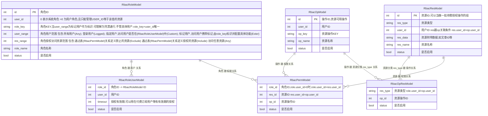
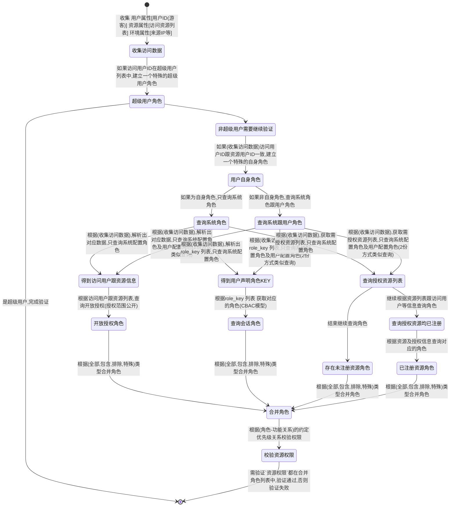

## 当前系统权限说明

> 本系统功能描述：授权方`系统或指定用户` 对 访问方`被授权用户或游客` 在进行 指定资源(系统资源或用户资源)访问时 进行授权的功能

> 本系统基于 [rbac模型](https://www.redhat.com/zh/topics/security/what-is-role-based-access-control) ,其中`user_id=0`的为系统权限,`user_id>0`的指定用户权限

> 资源约定:其中`user_id=0`的为系统资源,`user_id>0`的指定用户资源

> 限制:当角色`user_id=0`时，可往角色添加用户资源`user_id>0`,当角色`user_id>0`时,仅可添加用户跟角色`user_id`相同的资源

> 本系统在rbac模型的进行了以下扩充:

1. 在角色-用户关系

    - 字段为 user_range=RbacRoleUserRange::Custom,表示关联的用户由表`rbac_role_user`决定
    - 字段为 user_range=RbacRoleUserRange::Any,表示角色关联任意用户
    - 字段为 user_range=RbacRoleUserRange::Logged,表示角色关联任意已登录用户
    - 字段为 user_range=RbacRoleUserRange::Session,该角色不关联具体用户,用于授权会话时,由`role_key` 决定

    > RbacRoleUserRange::Session 使用场景说明:
    ```
    希望角色包含用户，独立于用户体系之外。例如:希望有一类角色在`编码阶段`定义时 , 如以下例子.
    1. 访问者ip为某值时，希望有特殊的权限，则在代码中判断ip等于某值时，传入特定关系角色，以实现授权或禁止访问
    2. 当前系统的`应用`，目前以一个整体进行授权，所以在应用调用时会传入app-{id}的系统关系角色，再通过配置该角色来实现授权管理
    3. 当用户希望他的粉丝才能访问他的某些信息时，可以传入一个属于他的粉丝的关系，以实现授权或禁止访问
    总结：需要一个由系统外决定的角色时，可以使用`会话角色`来实现。
    ```

2. 在角色-功能关系

    a. 当角色 `user_id=0`时:

     - 字段为 res_range=RbacRoleResRange::Exclude,不可访问资源由表`rbac_perm`决定
     - 字段为 res_range=RbacRoleResRange::Any,可以访问任意资源
     - 字段为 res_range=RbacRoleResRange::Include,可以访问资源由表`rbac_perm`决定

    b. 当角色 `user_id>0`时:

      - 字段为 res_range=RbacRoleResRange::Exclude,不可访问资源由表`rbac_perm`决定,其中资源`user_id`必须角色`user_id`相同
      - 字段为 res_range=RbacRoleResRange::Any,可以访问该用户(ROLE.USER_ID)的任意资源
      - 字段为 res_range=RbacRoleResRange::Include,可以访问资源由表`rbac_perm`决定,其中资源`user_id`必须角色`user_id`相同

    > 约定优先级: `user_id=0` > `user_id>0` ; Exclude > Any > Include 

### 资源 - 角色 - 用户 ER 图



### 授权流程

> 当访问的`user_id=0`时表示游客,大于0时为指定用户ID进行授权检查

> 资源由资源类型+资源数据组成,如:资源类型:文章 资源数据:文章ID

> `超级用户`跟`用户自身资源`在代码中处理.双向反查时[指定用户获取可访问资源,指定资源获取可访问用户]也同样做特殊处理.

> 鉴权时先根据访问的信息,查询出可用的角色,在进行鉴权处理




### 使用系统参考:

> 以下为不同场景的配置参考:

1. 简单控制系统资源是否可被访问，如指定页面是否可被访问

```
1. 通过接口或后台建立资源
2. 系统建立角色
    用户范围:全部用户(RbacRoleUserRange::Any)
    授权范围:自定义配置访问资源(RbacRoleResRange::Include):关联上面建立资源
```


2. 控制系统资源是否可被指定角色的用户访问

```
1. 通过接口或后台建立资源
2. 系统建立角色
    用户范围:指定用户(RbacRoleUserRange::Custom)
    授权范围:自定义配置访问资源(RbacRoleResRange::Include):关联上面建立资源
```

3. 控制系统或用户资源是否可被特定角色访问

> 系统资源示例： 特定IP可访问，当IP为指定IP时，权限校验传入特定角色参数

```
1. 通过接口或后台建立资源
2. 系统或用户建立角色
    用户范围:会话角色(RbacRoleUserRange::Session)
    授权范围:特定IP全局可访问时，可用 (RbacRoleResRange::Any) 操作 或 可访问某些权限 (RbacRoleResRange::Include)
```

> 用户资源示例：粉丝关系，当为粉丝关系时，权限校验传入特定角色参数

```
1. 已知数据: a用户id b用户id a用户跟b用户关系
2. 定义资源：资源: {用户b}{文章id} 操作: {文章id}查看
3. 用户b在用户后台或通过接口配置该关系的权限:定义关系key：{用户b}的firend
4. 访问时，用户a授权传入关系key:{用户b}的firend
5. 系统或用户建立角色
    用户范围:会话角色(RbacRoleUserRange::Session)
    授权范围:可访问某些权限 (RbacRoleResRange::Include)
```

4. 系统关闭权限控制,开放所有权限

```
1. 系统建立角色
    用户范围:任意用户(RbacRoleUserRange::Any)
    授权范围:授权访问任何资源(RbacRoleResRange::Any)
```

5. 系统指定用户赋予所有权限

```
1. 系统建立角色
    用户范围:指定用户(RbacRoleUserRange::Custom)
    授权范围:授权访问任何资源(RbacRoleResRange::Any)
```


### 一些常见问题

1. 关于如何定义资源创建:
> 此操作可通过 系统后台 完成. 在`系统管理`-`授权管理`-`资源管理` 中操作
```
例如:文章[资源类型:文章 资源数据:文章ID 资源名称:文章标题]
```

2. 关于解决`会话角色`问题:
> 此操作可通过 系统后台 完成. 在 `用户中心`-`授权管理` 或 `系统管理`-`授权管理`-`系统角色` 中操作
```
例如:当B为A的粉丝时,B才能看A的文章
可以先定义一个`会话角色`: A的粉丝的角色
权限系统提供`A的粉丝的角色`的可用权限管理操作
校验权限时:根据查询B是否A粉丝,传入上面定义的`会话角色`的标识符,完成权限校验
```
```
例如:当为VIP级别为N时,可参与某活动
可以先定义一个`会话角色`: VIP为N的角色
权限系统提供`VIP为N的角色`的可用权限管理操作
校验权限时:根据用户的VIP等级传入对应的`VIP为N的角色`,完成权限校验
```

3. 关于校验权限时所需参数问题:
> 验证权限时，需要的参数预知以下参数:
```
1. 用户ID,游客传入时用户ID为0
2. 收集需要校验权限的 资源权限标识 参见(问题1,问题2)[check_vec]
3. 收集 会话角色 的标识符列表 参见(问题3)[role_key_vec]
4. 完成以上参数收集后，在通过校验权限接口完成权限校验 :参见 RbacAccess 的 check 方法
```
---